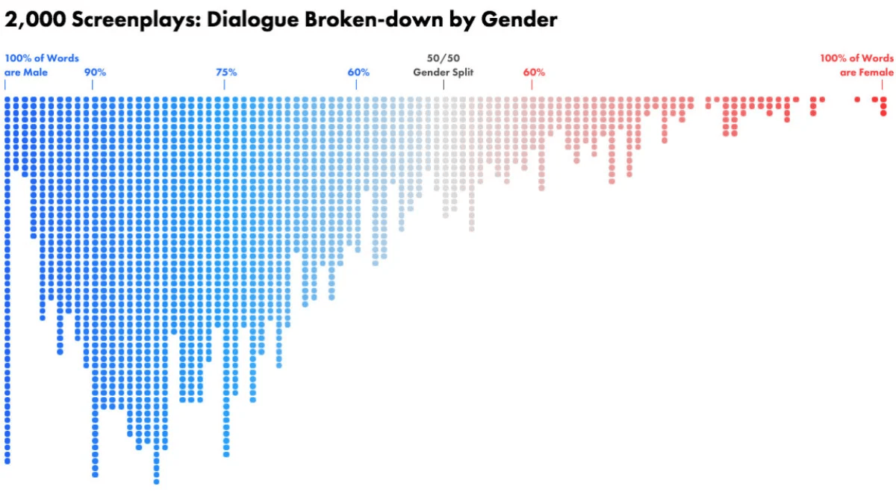

# Data Visualization Report: "2,000 Screenplays: Dialogue Broken-down  by Gender"
## By Isabelle Henderson
*07/12/2023* 

:calendar:

## Data Viz Summary

This data visualization is a dot plot that displays the distribution of dialogue between men and women in 2,000 screenplays. The data is measured by percentages, ranging from screenplays where 100% of words are male and 100% of words are female. The way this data is displayed showers viewers that there is an uneven distribution of speaking roles in screenplays between men and women. A vast majority of screenplays have over half the dialogue coming from men. Essentially, this data is communicating a disparity in men and women and how much talking time they may get on the screen. As [mashable.com](https://mashable.com/article/film-dialogue-gender-charts) says:
> It paints a pretty one-sided picture of the roles men and women play in America's highest grossing films.

## Data Viz Biography
1. **Who or what institution produced the visualization?** 

This visualization was produced by Hanah Anderson and Matt Daniels.

2.**When was it produced?**

April 2016

3. **Who is the audience for the visualization?**

This audience could have many audiences it was intended for, including consumers of film or even film creators themselves. The data could highlight disparities that may not be realized by those who consume biased media or those who create them.

4. **How might the visualization be interpreted or misinterpreted? What consequences might this interpretation/misinterpretation have?**

As always, data like this can be misinterpreted. One may interpret this data as a display of the proportion of male and female roles in movies. However, this data doesn't display that information and instead shows the nature of male and female roles themselves. This may have consequences as audiences will extract different ideas than were being conveyed with the graph and miss crucial information regarding sexism in the film industry.

5. **How, if at all, does the data visualization represent power or systems?**

This visualization could represent the power dynamics of gender in the film industry. As stated previously, the graph clearly displays a disproportionate percentage of speaking roles between men and women in film. Film is an influential form of media and can reinforce gender biases by allocating most of the dialogue to men. Therefore, this visualization helps bring attention to those issues of power in a prominent industry in our society. 